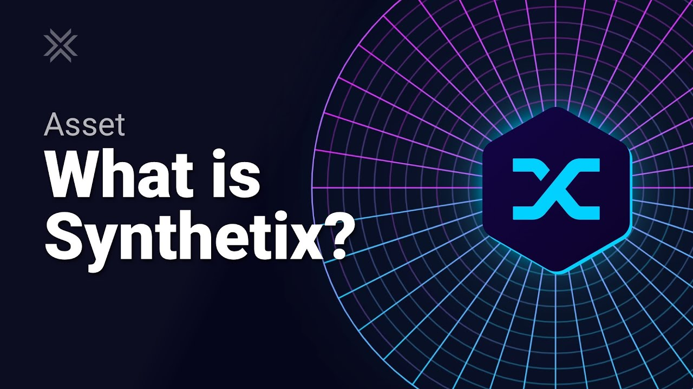

# Synthetix Case Study

Overview and Origin
Synthetix

When was the company incorporated?

2017 in Sydney, New South Wales

Who are the founders of the company?
Kain Warwick

How did the idea for the company (or project) come about?
They originally started by creating a Synthetic for the US Dollar to be used as payments separate from the traditional banking system. but as stablecoins emerged they realized they needed to differentiate themselves. This is when they started to create synthetics for cryptocurrencies, commodities, and equities.

How is the company funded? How much funding have they received?
Decentralized trading platform Synthetix has raised $12 million from venture capital firms Coinbase Ventures, Paradigm, and IOSG. The raise looks to be a rare occurrence of VCs investing through the purchase of a platform’s native token directly from its treasury rather than wiring funds to its founders.

Business Activities:
What specific financial problem is the company or project trying to solve?
It allows anyone to collateralize and issue synthetic assets And provides a zero slippage peer-to-contract exchange for trading them.

Who is the company's intended customer? Is there any information about the market size of this set of customers?
Anyone in the world that wants to invest in cryptocurrencies, commodities, and equities. Without having country restrictions.

What solution does this company offer that their competitors do not or cannot offer? (What is the unfair advantage they utilize?)
They are a noncustodial solution to liquidity pools where you can take leveraged positions of BitCoin without having to hand over custody of your assets.

Which technologies are they currently using, and how are they implementing them? (This may take a little bit of sleuthing–– you may want to search the company's engineering blog or use sites like Stackshare to find this information.)
Google Cloud Platform

Landscape:
What domain of the financial industry is the company in?
Financial Software

What have been the major trends and innovations of this domain over the last 5-10 years?
The creation of synthetics not just for the USD but for any type of asset.

What are the other major companies in this domain? B2C2 is a cryptocurrency liquidity provider. Stably is a company that connects real assets to the digital economy by providing a stablecoin, a digital version of the physical dollar. FTB (FinTech Bank Project) is a fintech company focused on digital assets. Efficient Frontier is a company that provides professional liquidity management, analytics, and trading execution for digital assets.
Results
What has been the business impact of this company so far? Synthetix has been one of the fastest-growing DeFi protocols in a sector that has expanded itself by 250% since the beginning of 2021.

What are some of the core metrics that companies in this domain use to measure success? How is your company performing, based on these metrics?

Total Value Locked (TVL) on Synthetix is around $2.38 billion according to the exchange itself. Data providers such as DeFiPulse and DappRadar are reporting between $2.23 and $2.39. So the figures are pretty close. The former has ranked Synthetix at an eighth place just behind Instadapp.

How is your company performing relative to competitors in the same domain?
Since the beginning of 2021, Synthetix TVL has increased around 90% so it is a little behind the growth rate of the industry as a whole in terms of TVL. This may be due to the complexity associated with using the platform compare to simple token swapping interfaces such as Uniswap.

Recommendations
If you were to advise the company, what products or services would you suggest they offer? (This could be something that a competitor offers, or use your imagination!)
I would suggest a free course or at least tutorial done directly by them, as it is one of the harder to use pool protocols.

Why do you think that offering this product or service would benefit the company?
They already offer an amazing product but its not user friendly so it would increase their user count by huge numbers.

What technologies would this additional product or service utilize?
Youtube

Why are these technologies appropriate for your solution?
They would work as visual aids or tutorials on how to use the applications.

